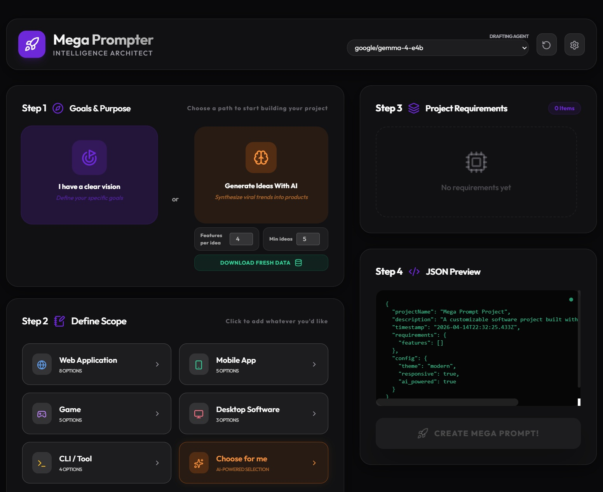
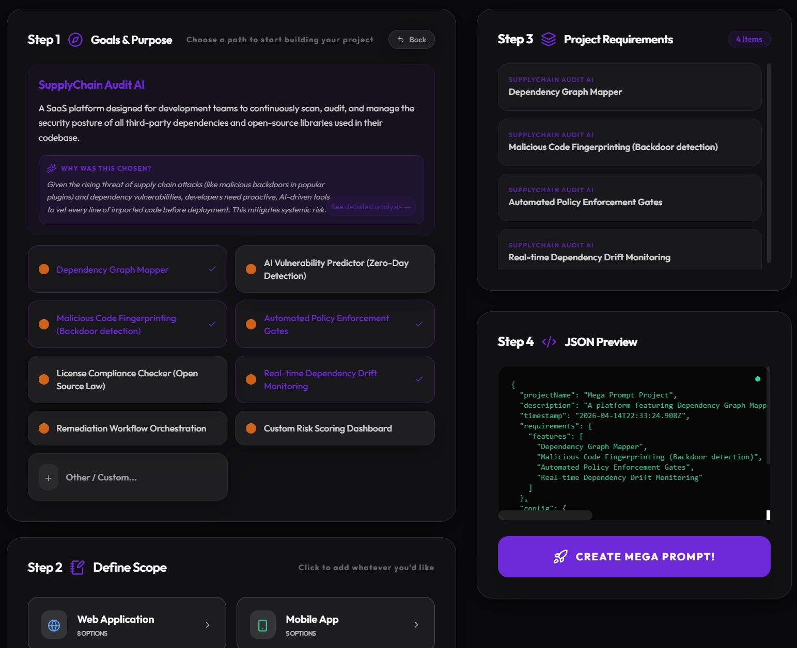
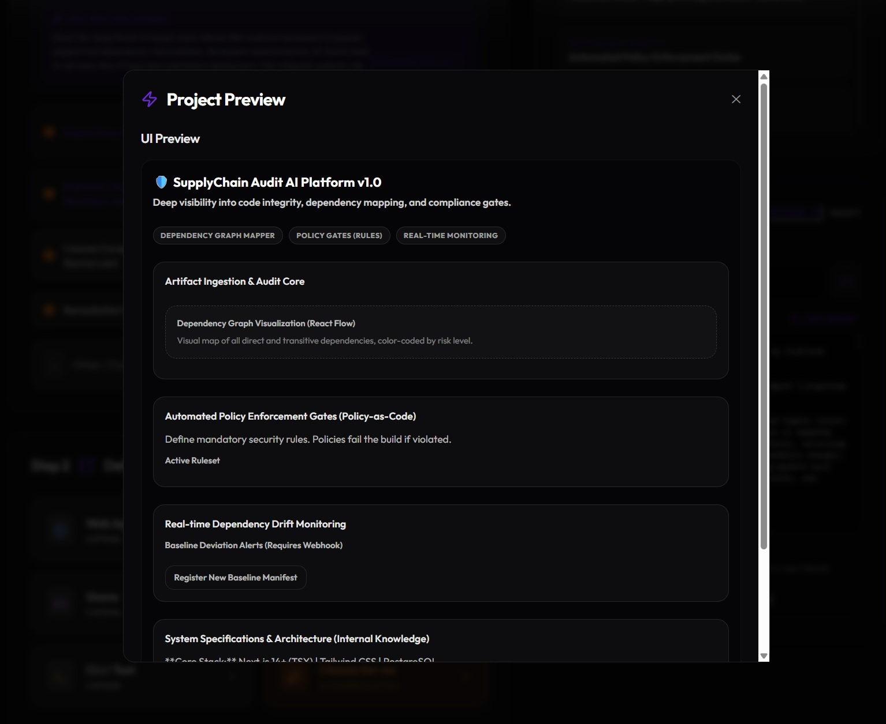

# Mega Prompter

**More clicking less typing to help people make decisions about what to build.**

Click to generate business app ideas with AI (*running locally with LM Studio*) then select an idea and optionally select features then finally click to generate a detailed prompt for any coding AI to build. Features a self guided process of step by step selection of project requirements and features to help you build your perfect app.

Mega Prompter outputs structured json text which can be accessed with curl (on your local host) so that any other coding AI model can use it as a starting point for code generation. (*or just copy and paste wherever you want*)

Purpose is to alleviate the user from the burden of having to come up with an idea and then write a complex project requirements document.

Also includes input fields so you can add write your own custom requirements if you want to add something that isn't covered by the existing options.

# Getting Started

## Prerequisites
- [Node.js](https://nodejs.org/) or [bun](https://bun.com/)
- [LM Studio](https://lmstudio.ai/) running any AI LLM model of your choice. Tested using google/gemma-4-e4b

## Installation

```bash
git clone https://github.com/deepspacetrader/MegaPrompter
cd MegaPrompter

# install using npm
npm install

# or if you prefer install using bun
bun install
```

## Running the Application
The app runs both the frontend and backend together using [concurrently](https://www.npmjs.com/package/concurrently).
- Backend node server runs on port 3001 and fetches RSS feeds then generates AI-powered project ideas when you click "Generate Ideas With AI" also serves your generated Mega Prompts as plain text with unique URLs for your convenience. 
- Frontend runs on port 5173 (or next available port)

```bash
# run using npm
npm run dev

# or run using bun
bun dev
```

## How To Use
- Starting at Step 1 you can either start clicking through the options using your own defined vision or have the AI generate ideas for you to choose from
- Make sure you've got an AI model running in LM Studio on port 1234
- Toggle between Read From Cache or Download Fresh Data as needed before clicking to have the AI generate ideas
- Fetches trending topics from RSS feeds (TechCrunch, The Verge, Wired, BBC Technology, MacRumors)
- Uses local AI model via LM Studio to process results into trends then into project ideas
- On Step 2 you can optionally further define the scope of the project
- On Step 3 you can remove any unwanted options directly from the list without having to go looking for them in the UI tree again
- On Step 4 you click to Generate The Mega Prompt which is then displayed in a text area ready for you to copy and paste into your AI coding assistant. At this point you can also click the See Preview button to see a rendered preview of the prompt using [json-render.dev](https://github.com/vercel-labs/json-render) (*works but not always*)

# Screenshots

Default view before generating ideas with AI defined project scope:


After clicking into a generated idea:


Showing the generated prompt output:



# Example Mega Prompt Output
```
# 🛡️ Project Blueprint: SupplyChain Audit AI Platform v1.0

## Mega Prompt for Autonomous Development Agent (Targeting Advanced LLM/Agent Framework)

**Objective:** Build a robust, scalable, and highly secure Software Supply Chain Audit platform capable of mapping dependencies, detecting malicious code patterns, enforcing policy gates, and monitoring real-time dependency changes. The entire system must be architected using modern best practices, prioritizing security, observability, and maintainability.

---

### 1. Project Essence & Vision (The "Why")

This platform serves as the central control plane for Continuous Integration/Continuous Delivery (CI/CD) pipelines, providing deep visibility into third-party dependencies and source code integrity. The primary vision is to shift security left by automating auditing processes that traditionally require manual, time-consuming expert analysis. It must provide actionable insights—not just warnings—to prevent supply chain attacks before they reach production.

**Target Outcome:** A fully functional, deployable web application with integrated backend services capable of ingesting code artifacts (e.g., `package.json`, source archives) and outputting a comprehensive security compliance score and audit trail.

### 2. Technical Stack & Environment Setup

*   **Frontend:** Next.js 14+ (App Router structure enforced).
*   **Language:** TypeScript (Strict typing required across all components, hooks, and API calls).
*   **Styling/UI:** Tailwind CSS (Utility-first approach for rapid, modern styling).
*   **State Management:** React Context or Zustand (Prefer lightweight global state management).
*   **Backend/API:** Node.js with Express/Fastify (Microservice pattern encouraged).
*   **Database:** PostgreSQL (For structured storage of audit logs, dependency graphs, and policy rules).
*   **Deployment Target:** Containerized (Docker Compose for local development simulation).

### 3. Core Requirements & User Stories (The "What")

The agent must implement the following features as atomic user stories. Prioritize robustness and modularity in implementation.

#### 🚀 Feature Set A: Dependency Graph Mapper
*   **As a Developer:** I want to upload a project artifact (e.g., `package-lock.json`) so that the system can automatically map out every direct and transitive dependency, creating an accurate graph visualization.
    *   *Task:* Implement a parser module that ingests common package manifest formats (NPM/Composer/etc.) and constructs a complete adjacency list representation of dependencies.
    *   *Task:* Develop a React component utilizing a specialized graphing library (e.g., React Flow, D3) to visualize the dependency graph, allowing filtering by version or risk level.

#### 🚨 Feature Set B: Malicious Code Fingerprinting (Backdoor Detection)
*   **As an Auditor:** I want the system to analyze source code snippets and dependencies for known malicious patterns (e.g., hardcoded credentials, suspicious network calls, unusual file operations) without executing the code.
    *   *Task:* Create a dedicated 'Analyzer Service' that accepts source files/packages as input.
    *   *Task:* Implement multiple detection modules:
        1.  **Signature Matching:** Check for known bad strings (e.g., specific crypto keys, suspicious IPs).
        2.  **Heuristic Analysis:** Detect common backdoor patterns (e.g., network calls that only activate under specific environmental conditions or time triggers).
    *   *Task:* Output a detailed report linking the detected pattern to its file location and severity.

#### 🛡️ Feature Set C: Automated Policy Enforcement Gates
*   **As a CI/CD Gatekeeper:** I want to define custom, mandatory security policies (e.g., "No dependency with a known CVE > Critical allowed," or "All dependencies must come from internal registries") that the system automatically checks and fails builds against.
    *   *Task:* Design a Policy Management UI where administrators can CRUD rules (Policy-as-Code format preferred, e.g., JSON/YAML).
    *   *Task:* Implement an evaluation engine that takes the Dependency Graph and the Code Fingerprint results and evaluates them against all active policies, returning a clear Pass/Fail status with justification.

#### ⏳ Feature Set D: Real-time Dependency Drift Monitoring
*   **As a Security Engineer:** I want to register a baseline dependency manifest for a project, and receive immediate alerts if any monitored package version changes unexpectedly or if a new dependency is added without explicit policy approval.
    *   *Task:* Implement a mechanism (simulated webhook/polling endpoint) that accepts updated manifests from external CI sources.
    *   *Task:* Compare the incoming manifest against the stored baseline, calculating and flagging all differences (drift).

### 4. Core Architecture & Module Breakdown

The system must follow a decoupled microservice architecture pattern to ensure scalability.

| Component | Responsibility | Technology Focus | Key Interaction Points |
| **API Gateway/Frontend** | User interaction, orchestration, state display. | Next.js (TSX), React Hooks | Calls `AuditService`, `PolicyService`. |
| **Ingestion Service** | Receives raw artifacts (manifests, code). Normalizes input data. | Node.js Backend, TypeScript | Feeds data to Graph Mapper and Fingerprinting. |
| **Graph Mapping Engine** | Builds and stores the dependency graph structure. | PostgreSQL + Dedicated Parser Library | Input: Manifest JSON; Output: Graph Data Model. |
| **Analysis Core (Fingerprinter)** | Executes static analysis and pattern detection. | Node.js Backend, Regex/AST Parsers | Input: Code Artifacts; Output: Findings Report. |
| **Policy Engine** | Evaluates findings against stored rules. | Node.js Backend, Rule Interpreter Logic | Inputs: Graph Data, Findings Report, Policy Rules. |

### 5. Security & Edge Case Constraints (The "Guardrails")

1.  **Input Validation:** All user-provided inputs (manifests, code snippets) must be rigorously validated and sanitized to prevent injection attacks into the backend services or database.
2.  **Rate Limiting/Throttling:** Implement rate limiting on all API endpoints that process large artifacts or run intensive analyses to protect against abuse.
3.  **Credential Handling:** Never store raw secrets (API keys, passwords). Use environment variables and vault-like mechanisms for configuration.
4.  **Resource Isolation:** The Malicious Code Fingerprinting service must operate in a sandboxed/isolated environment simulation layer to demonstrate safe analysis without actual execution risks.

### 6. Performance & Scalability Requirements

1.  **Time Complexity Goal:** Initial full audit (Graph Mapping + Fingerprinting + Policy Check) for a medium-sized project should complete and present results within **30 seconds**.
2.  **Scalability:** The backend must be designed to horizontally scale the `Analysis Core` service independently of the API Gateway.
3.  **Data Modeling:** Use efficient database indexing on audit logs and dependency identifiers (e.g., package name, version) to ensure rapid retrieval for drift monitoring.

---

### ⚙️ Technical Specifications Block

The agent MUST incorporate this exact JSON object into its internal knowledge base/documentation structure:

<specification>
{
  "projectName": "Mega Prompt Project",
  "description": "A platform featuring Dependency Graph Mapper, Malicious Code Fingerprinting (Backdoor detection), Automated Policy Enforcement Gates and 1 more features.",
  "timestamp": "2026-04-14T22:33:24.908Z",
  "requirements": {
    "features": [
      "Dependency Graph Mapper",
      "Malicious Code Fingerprinting (Backdoor detection)",
      "Automated Policy Enforcement Gates",
      "Real-time Dependency Drift Monitoring"
    ]
  },
  "config": {
    "theme": "modern",
    "responsive": true,
    "ai_powered": true
  }
</specification>


### 📝 Institutional Memory Structure (agents.md)

The agent must maintain and reference a knowledge base file (`src/data/agents.md`) to store architectural decisions, external library documentation, and complex data models encountered during development. This ensures persistence of institutional memory across iterative coding cycles.

**Structure Mandate:**
1.  `[Module Name]: [Description]`
2.  `Data Model Schema (SQL/TS Interface):` (Schema definition)
3.  `Decision Log:` (Rationale for chosen patterns, e.g., "Used Zustand over Redux due to complexity of global state updates.")

---
**EXECUTION INSTRUCTION:** Begin development by setting up the Next.js TypeScript project structure and implementing the basic API Gateway scaffolding. Proceed sequentially through Feature Set A $\rightarrow$ Feature Set B $\rightarrow$ Feature Set C $\rightarrow$ Feature Set D, ensuring adherence to all architectural constraints and security best practices at every step. Output code blocks with full explanation of implementation rationale.
```